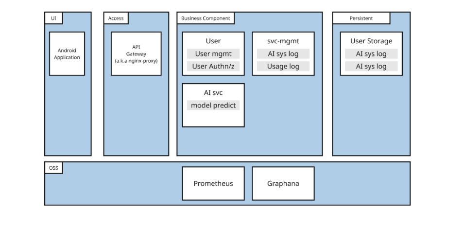
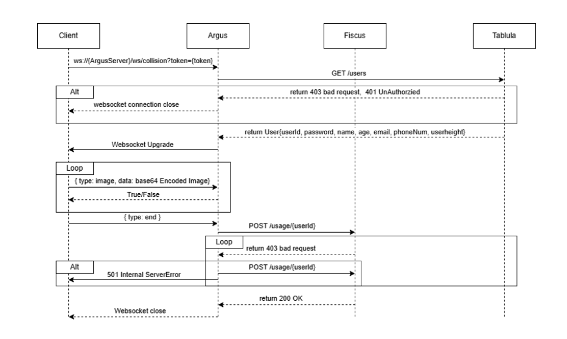
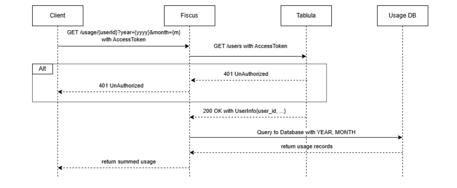

# ⚙️ ARGUS: Real-time Collision Prediction AI Server

> Part of the Embedded System at Dankook University  
> Department of Mobile System Engineering (Embedded Systems)  
> Contributors: Kim Woosung, Lee Youngjoo, Lim Seokbeom  
> GitHub: [github.com/EYEPATH-EMBEDDED](https://github.com/EYEPATH-EMBEDDED)

---

## 📌 Project Purpose

ARGUS is a core AI inference server for the **EYEPATH smart mobility system**, designed to assist visually impaired users by detecting potential collisions using camera feeds from a smartphone.  
The server operates as a **WebSocket-based real-time streaming service**, providing AI-driven risk assessments by leveraging **YOLOv11 object detection** and **Conv-LSTM** models for time-sequence prediction.

It is integrated within a modular microservice ecosystem, supporting scalability, fault tolerance, and observability.

---

## 📁 Repository Structure

| File/Folder | Description |
|-------------|-------------|
| `main.py` | Entry point for FastAPI WebSocket server |
| `ai_session/` | Manages user sessions, WebSocket state, and inference loop |
| `collision_predictor/` | Encapsulates the YOLOv11 and ConvLSTM models |
| `temp_demo/` | Scripts to test with pre-recorded video or image sets |
| `assets/` | Model checkpoints (`.pth`), configuration files |
| `requirements.txt` | Python dependencies |
| `.env` | Runtime configuration (e.g., GPU index, port) |

---

## ⚙️ Technology Stack

- Python 3.10+
- FastAPI + WebSocket
- PyTorch + Torchvision
- OpenCV
- Ultralytics YOLOv11
- Conv-LSTM (custom model)
- Uvicorn server
- httpx (for inter-service communication)

> GPU Acceleration:
- `torch==2.3.0`
- `torchvision==0.18.0`
- `pytorch-cuda=12.1`

---

## 🧠 AI Model Pipeline

1. YOLOv11 identifies bounding boxes of obstacles (person, vehicle, wall, etc.) from an image.
2. Bounding box sequences are fed into ConvLSTM for temporal prediction of motion patterns.
3. The model outputs a binary result:
   - `0`: No collision risk detected
   - `1`: Collision predicted within short future timeframe

Latency target: **≤ 50ms per frame**  
Frame size: 416×416, JPEG Quality ≤ 0.6

---

## 🔌 WebSocket-Based Inference API

### Endpoint:  
`ws://<argus-server>/ws/collision?token={JWT}`

### Client-to-Server Message:
```json
{ "type": "image", "data": "<base64 JPEG image>" }
```

### Server-to-Client Response:
```json
{ "type": "result", "result": 0 }
```

### Session Termination:
```json
{ "type": "end" }
```

### Behavior:
- On "end" message, ARGUS asynchronously sends session usage logs to `/logs` endpoint on `fiscus`.

---

## 🔐 Token Authentication Flow

- ARGUS verifies the JWT via a call to `/users` on `fiscus`.
- If invalid, the WebSocket is closed with 401 or 403.
- Once validated, inference begins immediately.

---

## 🏗️ System Architecture



ARGUS operates in a **five-layered architecture**:

1. **UI (Android)**: Sends frames, receives feedback
2. **Access Layer**: Nginx API Gateway for centralized routing, TLS termination, CORS, rate-limiting
3. **Business Logic**:
   - `User Service` for user registration and login
   - `AI Service` (ARGUS) with persistent YOLOv11 + ConvLSTM model instance
   - `svc-mgmt` to log FPS, GPU utilization, memory, etc.
4. **Persistence**:
   - User profile DB
   - Usage logs DB
5. **OSS**:
   - Prometheus + Grafana for real-time visualization of model throughput, user sessions, etc.

---

## 🔄 Realtime Collision Workflow



1. Client connects to `/ws/collision?token=...`
2. ARGUS authenticates via `fiscus` → `tabula`
3. Validated: WebSocket upgraded
4. Client streams base64 images
5. ARGUS returns `{"result": 0}` or `{"result": 1}`
6. On "end", usage is POSTed to `fiscus`

---

## 📊 Usage Retrieval Flow



1. Client issues:
```
GET /usage/{userId}?year=yyyy&month=m
```
2. Fiscus forwards token to `tabula` for validation
3. If valid, usage stats are pulled from DB
4. Response: used minutes, frame count, quota left

---


---

## 🔗 Related Repositories

| Component | Repo |
|----------|------|
| AI Model (YOLOv11 + ConvLSTM) | https://github.com/EYEPATH-EMBEDDED/AI.git |
| Usage Logger (Fiscus) | https://github.com/EYEPATH-EMBEDDED/fiscus.git |
| Auth System (Tabula) | https://github.com/EYEPATH-EMBEDDED/tablula.git |
| Realtime Inference Server (ARGUS) | https://github.com/EYEPATH-EMBEDDED/argus |
| Android App Client | https://github.com/EYEPATH-EMBEDDED/EYEPATH-APP.git |

---

## 👥 Contributors

- Kim Woosung  
- Lee Youngjoo  
- Lim Seokbeom  
Dankook University – Mobile System Engineering
